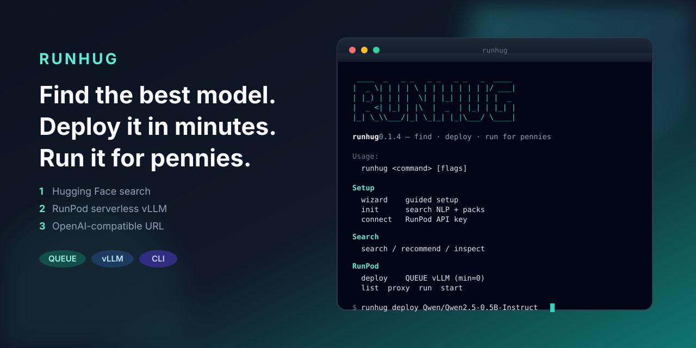

# runhug

<p align="center">
  
</p>

**Find the best model. Deploy it in minutes. Run it for pennies.**

## What it does

1. **Search** Hugging Face — find models that fit your use case (local SQLite index + optional embeddings)
2. **Deploy** RunPod serverless vLLM — one QUEUE endpoint in minutes (workers min=0)
3. **Use** an OpenAI-compatible URL — chat from any OpenAI client, `runhug run`, or `runhug start claude`

Deploy stays **RunPod-only** for now. Hugging Face is Hub search + optional embeddings — not GPU deploy. (HF Inference Endpoints bill while ready with long idle windows; RunPod serverless bills per second, which matches “run it for pennies.”)

## How to use

```bash
runhug wizard          # guided setup (no live deploy without confirm)
runhug init --yes      # search NLP + optional index packs
runhug connect         # RunPod API key
runhug connect hf      # optional Hub / embeddings token

runhug search -q "small instruct llm"
runhug recommend -q "cheap chat on a small GPU"
runhug deploy <model> --dry-run
runhug deploy <model>              # default endpoint type: QUEUE
runhug list
runhug proxy                       # local OpenAI proxy @ 127.0.0.1:8080/v1
runhug run [model]                 # chat
runhug start claude                # point Claude Code at the endpoint
```

**QUEUE** OpenAI base: `https://api.runpod.ai/v2/{id}/openai/v1`  
**Load balancer** OpenAI base: `https://{id}.api.runpod.ai/v1`

Other useful commands: `inspect`, `update` / `update --packs`, `gpus`, `url`, `status`, `local add` / `local setup`, `config get|set`. Env: `RUNPOD_API_KEY`, `HF_TOKEN`, `RUNHUG_CONFIG`, `NO_COLOR`.

## Install

**macOS / Linux:**

```bash
curl -fsSL https://raw.githubusercontent.com/adamsiwiec1/runhug/main/scripts/install.sh | bash
```

**Windows (amd64, PowerShell):**

```powershell
irm https://raw.githubusercontent.com/adamsiwiec1/runhug/main/scripts/install.ps1 | iex
```

**Go** (optional):

```bash
go install github.com/adamsiwiec1/runhug/cmd/runhug@latest
```

Scripts detect OS/arch, fetch the latest GitHub Release binary (`runhug_<ver>_…`, falling back to legacy `runhug-cli_` assets), and install as `runhug` / `runhug.exe`. Releases: [github.com/adamsiwiec1/runhug/releases](https://github.com/adamsiwiec1/runhug/releases).

From source: `git clone … && go build -o bin/runhug ./cmd/runhug`.

## License & contributing

[LICENSE](LICENSE) · [CONTRIBUTING.md](CONTRIBUTING.md) · [SECURITY.md](SECURITY.md) · [CHANGELOG.md](CHANGELOG.md) · [SUPPORT.md](SUPPORT.md)
