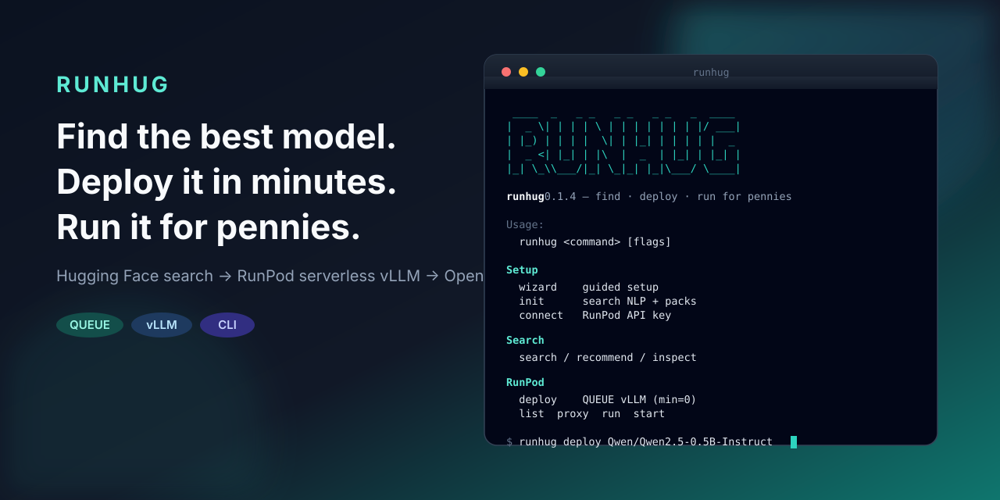

# runhug

<p align="center">
  
</p>

**Find the best model. Deploy it in minutes. Run it for pennies.**

Docs: [adamsiwiec1.github.io/runhug-cli](https://adamsiwiec1.github.io/runhug-cli/) (VitePress in `docs/`)

## Install

### Go (`@latest`)

```bash
go install github.com/adamsiwiec1/runhug-cli/cmd/runhug-cli@latest
```

Requires Go on your `PATH`. Binary name: `runhug-cli` (in `$(go env GOPATH)/bin` or `GOBIN`).

### Binary (curl)

Release assets are **bare binaries** (not archives), named `runhug-cli_<version>_<os>_<arch>` (Windows: `.exe`). The install script maps `uname` → asset and installs as `runhug` / `runhug.exe`.

**macOS / Linux:**

```bash
curl -fsSL https://raw.githubusercontent.com/adamsiwiec1/runhug-cli/main/scripts/install.sh | bash
```

Installs to `/usr/local/bin/runhug` when writable, otherwise `~/.local/bin/runhug`.

**Windows (amd64, PowerShell):**

```powershell
irm https://raw.githubusercontent.com/adamsiwiec1/runhug-cli/main/scripts/install.ps1 | iex
```

Exact asset URLs for `v0.1.4-beta.3` (swap the tag/version when a newer release ships):

```bash
# macOS Apple Silicon
curl -fsSL -o runhug https://github.com/adamsiwiec1/runhug-cli/releases/download/v0.1.4-beta.3/runhug-cli_0.1.4-beta.3_darwin_arm64
chmod +x runhug && sudo mv runhug /usr/local/bin/runhug

# macOS Intel
curl -fsSL -o runhug https://github.com/adamsiwiec1/runhug-cli/releases/download/v0.1.4-beta.3/runhug-cli_0.1.4-beta.3_darwin_amd64
chmod +x runhug && sudo mv runhug /usr/local/bin/runhug

# Linux amd64
curl -fsSL -o runhug https://github.com/adamsiwiec1/runhug-cli/releases/download/v0.1.4-beta.3/runhug-cli_0.1.4-beta.3_linux_amd64
chmod +x runhug && sudo mv runhug /usr/local/bin/runhug

# Linux arm64
curl -fsSL -o runhug https://github.com/adamsiwiec1/runhug-cli/releases/download/v0.1.4-beta.3/runhug-cli_0.1.4-beta.3_linux_arm64
chmod +x runhug && sudo mv runhug /usr/local/bin/runhug
```

```powershell
# Windows amd64
Invoke-WebRequest -Uri https://github.com/adamsiwiec1/runhug-cli/releases/download/v0.1.4-beta.3/runhug-cli_0.1.4-beta.3_windows_amd64.exe -OutFile runhug.exe
```

Releases: [github.com/adamsiwiec1/runhug-cli/releases](https://github.com/adamsiwiec1/runhug-cli/releases)

### From source (optional)

```bash
git clone https://github.com/adamsiwiec1/runhug-cli.git
cd runhug-cli
go build -o bin/runhug-cli ./cmd/runhug-cli
```

## What it does

1. **Hugging Face search** — find models that fit your use case
2. **RunPod serverless vLLM** — deploy an endpoint in minutes
3. **OpenAI-compatible URL** — chat from any OpenAI client

## First run

```bash
runhug-cli wizard          # guided setup (no live deploy without confirm)
runhug-cli init --yes      # search NLP + optional index packs
runhug-cli connect         # RunPod API key
runhug-cli connect hf      # optional Hub / embeddings token
```

## Everyday commands

```bash
runhug-cli search -q "small instruct llm"
runhug-cli recommend -q "cheap chat on a small GPU"
runhug-cli deploy <model> --dry-run
runhug-cli deploy <model>              # default endpoint type: QUEUE
runhug-cli list
runhug-cli proxy
runhug-cli run [model]                 # chat
runhug-cli start claude                # point Claude Code at the endpoint
```

QUEUE OpenAI base: `https://api.runpod.ai/v2/{id}/openai/v1`  
Load balancer OpenAI base: `https://{id}.api.runpod.ai/v1`

## Docs

| What | Where |
| --- | --- |
| Site | [GitHub Pages](https://adamsiwiec1.github.io/runhug-cli/) |
| Source | `docs/` — `npm ci && npm run docs:dev` |
| Contributing | [CONTRIBUTING.md](CONTRIBUTING.md), [SECURITY.md](SECURITY.md) |

Deploy stays **RunPod-only** for now (HF is Hub search + embeddings). See [Why RunPod-only](docs/guide/runpod-only.md).

## License

See [LICENSE](LICENSE).
